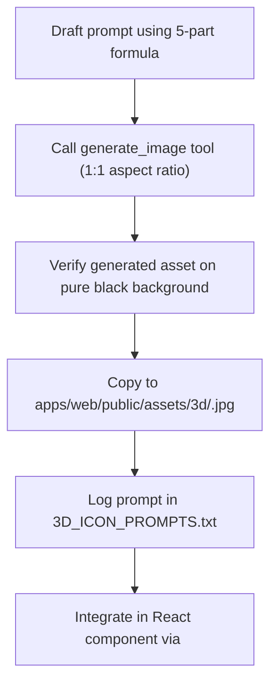

# Axiom 3D Glassmorphic Icon Design System & Agent Reference

> **Purpose**: This guideline ensures that all present and future 3D icons generated for **Axiom** maintain 100% visual consistency, Apple dark-glass aesthetics, and seamless UI integration across both web and desktop applications.

---

## 1. Visual Aesthetics & Core Principles

| Attribute | Specification |
| :--- | :--- |
| **Aesthetic Style** | Apple-inspired 3D Glassmorphism & Minimalist Claymorphism |
| **Materiality** | Translucent frosted glass, glossy refractive surfaces, smooth matte clay elements |
| **Lighting** | Soft studio rim lighting, subtle monochrome or single-hue edge glow |
| **Background** | **Strictly Solid Pure Black (`#000000`)** with zero backdrop elements |
| **Render Engine** | 3D Render, Octane Render, Raytracing, 8k resolution, Studio Lighting |
| **Aspect Ratio** | Always `1:1` square aspect ratio |

---

## 2. Prompt Formula & Structure

Every 3D icon prompt MUST follow this exact 5-part anatomical structure:

```
[1. Subject Motif] + [2. Glassmorphic Materiality] + [3. Domain Accent Glow] + [4. Isolated Black Background] + [5. Render Quality Engine]
```

### Template:
```text
Minimalist 3D glossy frosted glass and [DOMINANT_ACCENT_COLOR] [PRIMARY_OBJECT/MOTIF], high-end Apple 3D icon aesthetic, smooth claymorphic and translucent glass textures, subtle [ACCENT_COLOR] ambient edge glow, isolated on deep solid black background #000000, 3D render, octane render, raytracing, 8k
```

---

## 3. Domain Color Tokens

To preserve visual hierarchy, all icons must strictly adhere to the project's domain-specific color accents:

| Domain | Accent Hue | Hex Token | Example Prompts |
| :--- | :--- | :--- | :--- |
| **Student / Core AI** | Electric Apple Blue | `#0071e3` | Neural Brain, Graduation Cap, AI Tutor |
| **Teacher / Pedagogy** | Warm Amber Gold | `#ff9f0a` | Lecture Podium, Slide Projector, Exam Seal |
| **Institutional Admin / ERP** | Solid Emerald | `#30d158` | Security Shield, Admissions Roster, Attendance |
| **Hardware / Vector DB** | Slate / Neon Cyan | `#38bdf8` | Silicon Microchip, LanceDB Vector Index, Storage |

---

## 4. Strict Prohibitions & Anti-Patterns

> [!IMPORTANT]
> **STRICT AGENT RULES FOR 3D ASSETS**
> 1. **NO Multi-Color Rainbow Gradients**: Never use multi-color gradient prompts (e.g., "rainbow", "pink to green gradient"). Use a single unified hue or crisp monochrome glass.
> 2. **NO Background Clutter**: Never include environmental rooms, desks, walls, or shadows on external floors. The background must be pure solid `#000000` so it blends seamlessly into Axiom's dark cards.
> 3. **NO Text Watermarks**: Avoid prompt instructions that produce random gibberish text or heavy labels on the 3D asset.
> 4. **NO Unicode Arrows or Emojis**: Follow project-wide rules prohibiting unicode arrows and emojis.

---

## 5. Standard Step-by-Step Generation Workflow

When an agent needs to add a new 3D icon to Axiom:



### 1. Execute `generate_image`
```json
{
  "ImageName": "feature_<name>_3d",
  "Prompt": "Minimalist 3D glossy frosted glass and [COLOR] [OBJECT], high-end Apple 3D icon aesthetic, translucent glass textures, subtle [COLOR] edge glow, isolated on deep solid black background #000000, 3D render, octane render, 8k",
  "AspectRatio": "1:1"
}
```

### 2. Copy Asset to Public Assets Directory
```powershell
Copy-Item '<appDataDir>\brain\<conversation-id>\<image_name>_*.jpg' 'D:\BE-Project\apps\web\public\assets\3d\<icon_name>.jpg'
```

### 3. Record in Catalog
Append the prompt and status to [`3D_ICON_PROMPTS.txt`](file:///D:/BE-Project/3D_ICON_PROMPTS.txt).

### 4. UI Implementation Standard
Wrap the 3D icon in an Apple dark surface container with a subtle ambient glow:
```tsx
<div className="relative h-16 w-16 rounded-2xl bg-[#1c1c1e] border border-white/10 overflow-hidden flex items-center justify-center p-1 shadow-inner">
  
</div>
```

---

## 6. Reference Master Prompts (Ground Truth Examples)

### Example 1: Student Workspace Cap
> `Minimalist 3D glossy frosted glass and electric blue graduation cap and floating digital book, high-end Apple 3D icon aesthetic, smooth claymorphic and translucent glass textures, subtle neon blue ambient edge glow, isolated on deep solid black background #000000, 3D render, octane render, raytracing, 8k`

### Example 2: Teacher Studio Podium
> `Minimalist 3D glossy frosted glass and warm amber gold lecture clipboard, podium and laser pointer icon, high-end Apple 3D icon aesthetic, translucent glass with soft gold lighting accents, smooth matte textures, isolated on deep solid black background #000000, 3D render, octane render, raytracing, 8k`

### Example 3: Admin Institutional Shield
> `Minimalist 3D glossy frosted glass and emerald green institutional security shield emblem with classical university pillars inside, high-end Apple 3D icon aesthetic, sleek frosted glass and emerald lighting accents, isolated on deep solid black background #000000, 3D render, octane render, raytracing, 8k`

### Example 4: AI Neural Brain
> `Minimalist 3D glossy frosted glass AI neural brain with glowing electric blue circuitry and floating holographic nodes, Apple 3D icon design, translucent frosted glass with blue neon light, isolated on deep solid black background #000000, 3D render, octane render, 8k`
