# AXIOM Project — Comprehensive System Audit & Remaining Phases Roadmap

> **Platform**: Axiom — Local-First, Air-Gapped Curriculum-Aware Learning & Teaching Platform  
> **Status**: Comprehensive Analysis & Implementation Blueprint  
> **Target**: 100% Completely Working Local-First Experience (Zero Mocks, Real Ingestion, True .rssh Packaging, Live Offline Inference)

---

## 1. Executive Summary & Current State Audit

Axiom has established a robust architectural foundation with high-performance local RAG (FastAPI + LanceDB + SQLite FTS5), streaming local/cloud LLM inference (Ollama + Gemini/OpenAI fallbacks), and a high-aesthetic Vite + React 19 (Tailwind CSS v4) frontend interface.

However, a detailed inspection reveals that several critical user workflows currently terminate in **client-side `setTimeout()` simulations, schema mismatches, or missing backend file endpoints**. To make the project completely working as desired, these simulated layers must be replaced with real end-to-end pipeline execution.

### Current Implementation Status Matrix

| Subsystem / Feature | Current Status | Deficit / Gaps to 100% Completion |
| :--- | :---: | :--- |
| **System Diagnostics & Model Setup** | **Fully Working** | Hardware scanning, RAM detection, and Gemini/Cloud key validation operate smoothly. |
| **Grounded RAG Chat Engine** | **Fully Working** | Hybrid vector + FTS5 search (RRF) with streaming token generation operates offline and online. |
| **Document Ingestion (Teacher)** | **Partially Working** | Backend pipeline extracts PDFs/TXTs into LanceDB, but Frontend only offers a text box with heuristic summary. No real file upload or document management UI. |
| **Exam Blueprint Generator (Teacher)** | **Mocked in UI** | Backend has logic, but Frontend uses a simulated `setTimeout()` with static text. No `.docx` export file generation or download. |
| **Lecture Slides Generator (Teacher)** | **Partially Working** | Backend generates real `.pptx` via `python-pptx`, but Frontend lacks a download button and backend lacks a file serving endpoint. |
| **Package Compilation (.rssh Export)** | **Mocked in UI** | Backend has zip compiler, but Frontend uses simulated `setTimeout()`. No real file download trigger. |
| **Package Ingestion (.rssh Import)** | **Missing in UI** | Backend has zip unpacker and schema registration, but Frontend lacks a file dropzone or import trigger in Student mode. |
| **Adaptive Quizzes (Student)** | **Broken Schema** | Backend returns `options: { A: ..., B: ... }`, Frontend expects `options: string[]`. Throws runtime error, forcing hardcoded fallback. |
| **Flashcard Decks (Student)** | **Broken Schema** | Backend returns `{ cards: [...] }`, Frontend expects `res.flashcards`. Falls back to static cards; lacks spaced repetition intervals. |
| **PYQ Trend Predictor (Student)** | **Broken Schema** | Backend returns `high_probability_predictions`, Frontend looks for `recurring_topics`. Static mock displays instead of live data. |
| **Study Planner (Student)** | **Missing in UI** | Backend has `/student/study-plan` endpoint, but Frontend has no tab or view to display the 14-day study timetable. |
| **Curriculum Dynamic Loading** | **Hardcoded in UI** | Frontend relies on a static `SUBJECT_UNITS_MAP` rather than querying `/packages/{id}/curriculum` when switching subjects. |
| **Desktop Shell (`apps/desktop`)** | **Missing (Stub Only)** | Contains only a dummy `README.md`. No Electron shell, no `.rssh` file associations, no offline daemon launcher, no installer. |
| **Monorepo Packages (`packages/*`)** | **Empty Directories** | `packages/common` and `packages/ui` contain zero files. |
| **Design Rules Compliance** | **Minor Violations** | Found `ArrowRight` and `ArrowUpRight` icons violating the strict "No Arrows/No Emojis" project guideline. |

---

## 2. Detailed Technical Deficit Analysis

### 2.1 Backend Bugs & Endpoint Gaps
1. **SQLite Schema Inconsistency in `inspect_package` (`packages.py:163`)**:
   - Query attempts `SELECT ... FROM pyqs`, but table is named `pyq_questions` in `schema.py`.
   - Columns `bloom_level` and `topic_tag` do not exist on `pyq_questions`.
2. **Missing Binary File Serving Endpoints**:
   - Exported `.rssh` archives saved in `settings.UPLOADS_DIR` have no endpoint to stream or download via browser.
   - Generated `.pptx` presentations saved in `generated_materials` have no public download route.
   - Word `.docx` exam paper generation does not exist in `ExamPaperBuilder`.

### 2.2 Frontend-to-Backend Integration Gaps
1. **Teacher Mode — Document Ingestion UI**:
   - Must provide a real drag-and-drop file upload component accepting `.pdf`, `.docx`, `.txt`, and `.pptx`.
   - Must call `/api/v1/documents/upload` with `multipart/form-data`.
   - Must show live ingestion status: Page count, chunk count, vector embeddings indexed in LanceDB.
   - Must display the uploaded documents list via `/api/v1/documents/{subject_id}/list`.
2. **Teacher Mode — Exam Paper Builder**:
   - Must replace `setTimeout` with a live call to `/api/v1/teacher/question-papers`.
   - Must dynamically render generated Section A, Section B, and Section C questions with Bloom's taxonomy tags and marking schemes.
   - Must provide a working "Export Word (.docx)" button that triggers download of a real formatted `.docx` file.
3. **Teacher Mode — RSSH Compiler & Subject Creation**:
   - "Create New Subject" modal must call `POST /api/v1/packages/create` to initialize real directories and `subject.db`.
   - "Compile & Download .rssh" must call `POST /api/v1/packages/export/{subject_id}` and prompt immediate file download in the browser.
4. **Student Mode — Schema Alignment**:
   - **Quiz**: Update `QuizGenerator` or `StudentWorkspace` so `options` is formatted as an array `string[]` with `correct: number` (0-indexed). Add submission to `/api/v1/student/quizzes/grade`.
   - **Flashcards**: Fix response key mapping (`res.cards` vs `res.flashcards`). Add spaced repetition mastery buttons (Easy, Good, Hard).
   - **PYQ Predictor**: Fix response key mapping to render `high_probability_predictions` and `unit_distribution`.
   - **Study Planner**: Add a 6th student tab or dedicated modal displaying the adaptive revision schedule.
   - **RSSH Importer**: Add an "Import .rssh Package" file picker calling `POST /api/v1/packages/import`.

### 2.3 Desktop Container & Distribution (`apps/desktop`)
- Native Electron application wrapper missing entirely.
- Need native `.rssh` file association in Windows registry so double-clicking `.rssh` packages automatically launches Axiom and imports the syllabus.
- Need background daemon orchestration so the Electron wrapper quietly boots `apps/local-api` without opening detached console windows.

---

## 3. Master Roadmap: All Remaining Phases

```mermaid
flowchart TD
    subgraph Phase_07 ["Phase 7: Backend Robustness & File Engine"]
        P7_1["Fix SQLite Schema Mismatch in packages.py"]
        P7_2["Add File Download Endpoints (.rssh, .pptx, .docx)"]
        P7_3["Build Python-docx Exam Exporter"]
    end

    subgraph Phase_08 ["Phase 8: Teacher Workspace Live Integration"]
        P8_1["Real Multi-Format Document Upload Dropzone"]
        P8_2["Live Bloom's Exam Generator & DOCX Download"]
        P8_3["Live PPTX Slides Generation & Download"]
        P8_4["Live .rssh Package Compiler & Browser Download"]
        P8_5["Live Subject Workspace Creator"]
    end

    subgraph Phase_09 ["Phase 9: Student Workspace Live Integration"]
        P9_1["Align Quiz Options Array Schema & Grade Tracker"]
        P9_2["Align Flashcards Keys & Add Spaced Repetition"]
        P9_3["Align PYQ Predictor & Historical Trend Display"]
        P9_4["Build Adaptive Study Planner Timetable UI"]
        P9_5["Build Drag-and-Drop .rssh Package Importer"]
    end

    subgraph Phase_10 ["Phase 10: Dynamic Curriculum Synchronization"]
        P10_1["Replace Hardcoded Units Map with Live API Query"]
        P10_2["Dynamic Subject Switching & Real-Time Stats"]
        P10_3["Live .rssh Package Deep Inspector"]
    end

    subgraph Phase_11 ["Phase 11: Electron Container & Native Desktop"]
        P11_1["Scaffold Electron Shell in apps/desktop"]
        P11_2["FastAPI & Ollama Background Daemon Orchestration"]
        P11_3["Native .rssh OS File Association & IPC Channel"]
        P11_4["electron-builder Windows x64 Installer (.exe)"]
    end

    subgraph Phase_12 ["Phase 12: Monorepo Standards & Strict Guidelines"]
        P12_1["Populate packages/common Shared Data Contracts"]
        P12_2["Populate packages/ui Shared Glassmorphic Tokens"]
        P12_3["Remove Arrow Icons & Enforce Design Standards"]
    end

    subgraph Phase_13 ["Phase 13: Offline Air-Gapped E2E Verification"]
        P13_1["Zero-Network Ingestion to Local Ollama Chat Test"]
        P13_2["Teacher Export -> Student Import Verification"]
        P13_3["Performance & Vector Retrieval Benchmark (<40ms)"]
    end

    Phase_07 --> Phase_08
    Phase_08 --> Phase_09
    Phase_09 --> Phase_10
    Phase_10 --> Phase_11
    Phase_11 --> Phase_12
    Phase_12 --> Phase_13
```



---

### Phase 7: Backend Robustness & File Serving Engine [COMPLETED]

**Objective**: Ensure all database schemas, file generation pipelines, and HTTP file response streams operate with zero runtime errors.

#### Tasks:
1. **Fix `packages.py` SQL Query in `inspect_package`**: [DONE]
   - Correct table query from `FROM pyqs` to `FROM pyq_questions`.
   - Update selected columns to match `schema.py` (`id, year, exam_term, question_text, marks, unit_id, frequency_score`).
2. **Implement File Serving Endpoints**: [DONE]
   - `GET /api/v1/packages/download/{package_id}`: Streams compiled `.rssh` archive as an attachment with appropriate headers (`application/octet-stream`).
   - `GET /api/v1/teacher/download-material/{subject_id}/{filename}`: Streams generated `.pptx` or `.docx` files.
3. **Implement Real `.docx` Exam Paper Exporter**: [DONE]
   - In `apps/local-api/app/ai/teacher/exam_builder.py`, implement `export_docx()` using `python-docx`.
   - Formats institution header, course code, duration, total marks, instructions, Section A (Short), Section B (Analytical), and Section C (Comprehensive) with clean typography.
   - Saves file to `subject_dir / "generated_materials" / "{exam_title}.docx"`.
4. **Implement Unit Ingestion Verification**: [DONE]
   - Ensure `IngestionPipeline` verifies unit existence and updates document chunk counts consistently in SQLite.

---

### Phase 8: Teacher Workspace Live Functional Integration [COMPLETED]

**Objective**: Replace all mock handlers in `TeacherWorkspace.tsx` and `TeacherWelcomeHub.tsx` with live backend API connections.

#### Tasks:
1. **Document Upload & Ingestion Component**: [DONE]
   - Add a drag-and-drop file upload zone supporting `.pdf`, `.docx`, `.txt`, `.pptx`.
   - Allow selecting target unit (`Unit 1`, `Unit 2`, etc.) and document type (`Syllabus`, `Textbook`, `Notes`, `PYQ`).
   - Wire upload to `POST /api/v1/documents/upload`.
   - Display real-time progress: pages extracted, semantic chunks created, vector embeddings stored in LanceDB.
   - Display list of uploaded documents via `GET /api/v1/documents/{subject_id}/list` with file sizes and timestamps.
2. **Live Bloom's Taxonomy Exam Generator**: [DONE]
   - Remove `setTimeout()` mock in `TeacherWorkspace.tsx`.
   - Wire "Generate 100-Mark Blueprint" to `POST /api/v1/teacher/question-papers`.
   - Pass user-configured weights (`Remember`, `Understand`, `Apply`, `Analyze`) and target marks.
   - Render live returned sections (A, B, C) with question text, marks, cognitive level tags, and model marking keys.
   - Wire "Export Word (.docx)" button to trigger download of the real `.docx` file from backend.
3. **Live Slide Deck Generator & Download**: [DONE]
   - Wire "Generate Presentation (.pptx)" to `POST /api/v1/teacher/presentations`.
   - Display returned slide breakdown.
   - Add a primary "Download Presentation (.pptx)" button triggering download of the real `.pptx` file.
4. **Live .rssh Package Compilation & Download**: [DONE]
   - Remove `setTimeout()` mock in Export tab.
   - Wire "Compile & Download .rssh" to `POST /api/v1/packages/export/{subject_id}`.
   - Automatically trigger browser download of `[Subject-ID].rssh`.
5. **Live Subject Creation in Teacher Hub**: [DONE]
   - Wire "Create New Subject" modal in `TeacherWelcomeHub.tsx` to `POST /api/v1/packages/create`.
   - On success, refresh the subjects list and navigate into the newly created subject workspace.


---

### Phase 9: Student Workspace Live Functional Integration

**Objective**: Fix schema mismatches and wire all student revision tools to live backend data.

#### Tasks:
1. **Adaptive Quizzes Schema Alignment & Attempt Grading**:
   - Update `QuizGenerator.generate_quiz()` to return `options` as an array:
     ```json
     {
       "id": "qz_123_q1",
       "question": "What is L1 regularization?",
       "options": ["Ridge", "Lasso", "Elastic Net", "Dropout"],
       "correct": 1,
       "difficulty": "Medium",
       "explanation": "Lasso adds an absolute weight penalty...",
       "source": "Bishop Ch. 3.2"
     }
     ```
   - Update `StudentWorkspace.tsx` to display real question explanations and page citations upon answer selection.
   - Wire quiz completion to `POST /api/v1/student/quizzes/grade` to log score in `user_quiz_attempts`.
2. **Flashcards Schema Alignment & Spaced Repetition (SRS)**:
   - Fix response handler in `page.tsx`: accept both `res.cards` and `res.flashcards`.
   - Add spaced repetition rating buttons:
     - **Hard** (Review in 1 day)
     - **Good** (Review in 3 days)
     - **Easy** (Review in 7 days)
   - Store student mastery progress locally and update card difficulty weight.
3. **PYQ Predictor Schema Alignment**:
   - Fix `page.tsx` hook: map `data.high_probability_predictions` and `data.unit_distribution` returned from `GET /api/v1/teacher/pyq-trends/{subject_id}`.
   - Display recurring frequency, expected marks, recurrence history, and probability percentages dynamically.
4. **Adaptive Study Planner Timetable View**:
   - Create a dedicated Study Plan view in Student mode.
   - Wire to `POST /api/v1/student/study-plan` with inputs for exam countdown (days remaining) and daily target study hours.
   - Render day-by-day revision milestones, practice goals, and spaced repetition drills.
5. **Drag-and-Drop .rssh Package Importer**:
   - Add an "Import .rssh Package" button in `StudentWelcomeHub.tsx` and `SubjectModal.tsx`.
   - Support file picker and drag-and-drop of `.rssh` / `.zip` archives.
   - Call `POST /api/v1/packages/import`.
   - Upon completion, immediately refresh the subjects list and mount the imported course.

---

### Phase 10: Dynamic Curriculum & Multi-Subject Synchronization

**Objective**: Eliminate hardcoded subject maps and ensure instant, reactive curriculum switching.

#### Tasks:
1. **Eliminate Hardcoded `SUBJECT_UNITS_MAP`**:
   - Replace static unit definitions in `apps/web/src/app/page.tsx` with dynamic calls to `GET /api/v1/packages/{package_id}/curriculum`.
   - Populate units dropdown, unit topics, and chunk counts directly from `subject.db`.
2. **Reactive Subject Switching**:
   - When user selects a subject in `StudentWelcomeHub`, `TeacherWelcomeHub`, or `SubjectModal`:
     - Set active subject.
     - Fetch dynamic curriculum tree.
     - Fetch dynamic PYQ trends.
     - Reset chat session with subject-specific welcome message.
3. **Live .rssh Deep Inspector Modal**:
   - Ensure `RSSHPackageViewerModal.tsx` displays live SQLite table counts, LanceDB vector dimensions, and file tree from `GET /api/v1/packages/inspect/{package_id}`.

---

### Phase 11: Electron Desktop Container & Native Distribution (`apps/desktop`)

**Objective**: Provide a native desktop application container with offline background process management and `.rssh` file associations.

#### Tasks:
1. **Scaffold Electron Desktop Shell**:
   - Initialize `apps/desktop` with `package.json`, `main.js`, `preload.js`.
   - Configure window properties: Frameless or modern titlebar, dark theme, context isolation (`contextIsolation: true`, `nodeIntegration: false`).
2. **Local Daemon Orchestration**:
   - In Electron `main.js`, check if FastAPI (`http://127.0.0.1:8000`) is running.
   - If not running, spawn `apps/local-api` python process quietly without opening detached command prompt windows.
   - Verify Ollama daemon (`http://127.0.0.1:11434`) status and notify user if stopped.
3. **Native `.rssh` File Associations & IPC**:
   - Register file association for `.rssh` in `package.json` build configuration.
   - Listen for OS `open-file` events: when student double-clicks a `.rssh` file, Electron forwards the file path to Next.js via IPC (`mount-rssh-package`).
   - Web app unpacks and mounts the subject package automatically.
4. **Installer Packaging Pipeline**:
   - Configure `electron-builder` for Windows x64 (`nsis`, `zip`).
   - Bundle production Next.js static export / local server.
   - Create build command `npm run package:desktop`.

---

### Phase 12: Monorepo Standards & Strict Guidelines Compliance

**Objective**: Clean monorepo structure, populate shared contracts, and enforce strict UI design rules.

#### Tasks:
1. **Populate `packages/common`**:
   - Create shared TypeScript data types and schemas:
     - `SubjectManifest`, `PackageStats`
     - `UnitRecord`, `ChapterRecord`, `DocumentRecord`, `ChunkRecord`
     - `QuizQuestion`, `QuizResult`
     - `FlashcardItem`, `StudyScheduleItem`
     - `ExamPaperBlueprint`, `BloomDistribution`
2. **Populate `packages/ui`**:
   - Export shared glassmorphism styling utilities, color constants, and Apple Dark UI tokens.
3. **Strict Design Rules Cleanup**:
   - Remove all arrow icons:
     - Replace `<ArrowRight />` in `TeacherWelcomeHub.tsx` with `<Check />` or text only.
     - Replace `<ArrowUpRight />` in `RSSHPackageViewerModal.tsx` with `<ExternalLink />` or `<FileText />`.
   - Audit and confirm zero unicode arrows (`→`, `->`) and zero emojis across all frontend user-facing components.

---

### Phase 13: Air-Gapped End-to-End Verification & Production Hardening

**Objective**: Prove complete system operation in a simulated air-gapped offline environment with zero cloud connectivity.

#### Verification Matrix:
1. **Offline Ingestion & Packaging Test**:
   - Disconnect internet.
   - Create new subject "Distributed Computing".
   - Upload sample PDF textbook.
   - Verify text extraction, semantic chunking, and LanceDB embeddings.
   - Compile and download `Distributed-Computing.rssh`.
2. **Package Transfer & Import Test**:
   - Import `Distributed-Computing.rssh` into student workspace.
   - Verify instant database mounting and vector table validation without internet.
3. **Offline RAG & Tutor Chat Test**:
   - Start Ollama with `qwen2.5-coder:7b` or `llama3.2:3b`.
   - Ask: "Explain Lamport Timestamps according to Unit 2".
   - Verify SSE token streaming, sub-40ms vector similarity matching, and strict textbook citations.
4. **Revision Tools Offline Test**:
   - Generate adaptive quiz, submit answers, verify grading.
   - Flip flashcards, rate difficulty, verify deck progression.
   - Conduct Feynman teach-back evaluation and review AI feedback.

---

## 4. Immediate Next Steps & Execution Order

To achieve a completely working system, execution should proceed in this order:

1. **Step 1 (Phases 7 & 8)**: Fix backend schema bug in `packages.py`, add file download routes, wire real PDF/document upload, wire real Bloom's Exam generator with `.docx` export, and wire `.pptx` slides download.
2. **Step 2 (Phase 9 & 10)**: Align Quiz, Flashcard, and PYQ data schemas, add Study Planner UI, add `.rssh` file import dropzone, and switch units dynamically from backend database.
3. **Step 3 (Phase 11)**: Build the native Electron desktop container with `.rssh` double-click file associations and background daemon launcher.
4. **Step 4 (Phases 12 & 13)**: Monorepo shared packages, design rule compliance verification, and final offline air-gapped test suite.
