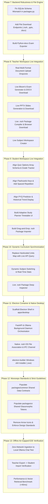

# AXIOM Project — Comprehensive System Audit & Remaining Phases Roadmap

> **Platform**: Axiom — Local-First, Air-Gapped Curriculum-Aware Learning & Teaching Platform  
> **Status**: Comprehensive Analysis & Implementation Blueprint  
> **Target**: 100% Completely Working Local-First Experience (Zero Mocks, Real Ingestion, True .rssh Packaging, Live Offline Inference)

---

## 1. Executive Summary & Current State Audit

Axiom has established a robust architectural foundation with high-performance local RAG (FastAPI + LanceDB + SQLite FTS5), streaming local/cloud LLM inference (Ollama + Gemini/OpenAI fallbacks), and a high-aesthetic Vite + React 19 (Tailwind CSS v4) frontend interface.

However, a detailed inspection reveals that several critical user workflows currently terminate in **client-side `setTimeout()` simulations, schema mismatches, or missing backend file endpoints**. To make the project completely working as desired, these simulated layers must be replaced with real end-to-end pipeline execution.

### Current Implementation Status Matrix

| Subsystem / Feature | Current Status | Deficit / Gaps to 100% Completion |
| :--- | :---: | :--- |
| **System Diagnostics & Model Setup** | **Fully Working** | Hardware scanning, RAM detection, and Gemini/Cloud key validation operate smoothly. |
| **Grounded RAG Chat Engine** | **Fully Working** | Hybrid vector + FTS5 search (RRF) with streaming token generation operates offline and online. |
| **Document Ingestion (Teacher)** | **Partially Working** | Backend pipeline extracts PDFs/TXTs into LanceDB, but Frontend only offers a text box with heuristic summary. No real file upload or document management UI. |
| **Exam Blueprint Generator (Teacher)** | **Mocked in UI** | Backend has logic, but Frontend uses a simulated `setTimeout()` with static text. No `.docx` export file generation or download. |
| **Lecture Slides Generator (Teacher)** | **Partially Working** | Backend generates real `.pptx` via `python-pptx`, but Frontend lacks a download button and backend lacks a file serving endpoint. |
| **Package Compilation (.rssh Export)** | **Mocked in UI** | Backend has zip compiler, but Frontend uses simulated `setTimeout()`. No real file download trigger. |
| **Package Ingestion (.rssh Import)** | **Missing in UI** | Backend has zip unpacker and schema registration, but Frontend lacks a file dropzone or import trigger in Student mode. |
| **Adaptive Quizzes (Student)** | **Broken Schema** | Backend returns `options: { A: ..., B: ... }`, Frontend expects `options: string[]`. Throws runtime error, forcing hardcoded fallback. |
| **Flashcard Decks (Student)** | **Broken Schema** | Backend returns `{ cards: [...] }`, Frontend expects `res.flashcards`. Falls back to static cards; lacks spaced repetition intervals. |
| **PYQ Trend Predictor (Student)** | **Broken Schema** | Backend returns `high_probability_predictions`, Frontend looks for `recurring_topics`. Static mock displays instead of live data. |
| **Study Planner (Student)** | **Missing in UI** | Backend has `/student/study-plan` endpoint, but Frontend has no tab or view to display the 14-day study timetable. |
| **Curriculum Dynamic Loading** | **Hardcoded in UI** | Frontend relies on a static `SUBJECT_UNITS_MAP` rather than querying `/packages/{id}/curriculum` when switching subjects. |
| **Desktop Shell (`apps/desktop`)** | **Missing (Stub Only)** | Contains only a dummy `README.md`. No Electron shell, no `.rssh` file associations, no offline daemon launcher, no installer. |
| **Monorepo Packages (`packages/*`)** | **Empty Directories** | `packages/common` and `packages/ui` contain zero files. |
| **Design Rules Compliance** | **Minor Violations** | Found `ArrowRight` and `ArrowUpRight` icons violating the strict "No Arrows/No Emojis" project guideline. |

---

## 2. Detailed Technical Deficit Analysis

### 2.1 Backend Bugs & Endpoint Gaps
1. **SQLite Schema Inconsistency in `inspect_package` (`packages.py:163`)**:
   - Query attempts `SELECT ... FROM pyqs`, but table is named `pyq_questions` in `schema.py`.
   - Columns `bloom_level` and `topic_tag` do not exist on `pyq_questions`.
2. **Missing Binary File Serving Endpoints**:
   - Exported `.rssh` archives saved in `settings.UPLOADS_DIR` have no endpoint to stream or download via browser.
   - Generated `.pptx` presentations saved in `generated_materials` have no public download route.
   - Word `.docx` exam paper generation does not exist in `ExamPaperBuilder`.

### 2.2 Frontend-to-Backend Integration Gaps
1. **Teacher Mode — Document Ingestion UI**:
   - Must provide a real drag-and-drop file upload component accepting `.pdf`, `.docx`, `.txt`, and `.pptx`.
   - Must call `/api/v1/documents/upload` with `multipart/form-data`.
   - Must show live ingestion status: Page count, chunk count, vector embeddings indexed in LanceDB.
   - Must display the uploaded documents list via `/api/v1/documents/{subject_id}/list`.
2. **Teacher Mode — Exam Paper Builder**:
   - Must replace `setTimeout` with a live call to `/api/v1/teacher/question-papers`.
   - Must dynamically render generated Section A, Section B, and Section C questions with Bloom's taxonomy tags and marking schemes.
   - Must provide a working "Export Word (.docx)" button that triggers download of a real formatted `.docx` file.
3. **Teacher Mode — RSSH Compiler & Subject Creation**:
   - "Create New Subject" modal must call `POST /api/v1/packages/create` to initialize real directories and `subject.db`.
   - "Compile & Download .rssh" must call `POST /api/v1/packages/export/{subject_id}` and prompt immediate file download in the browser.
4. **Student Mode — Schema Alignment**:
   - **Quiz**: Update `QuizGenerator` or `StudentWorkspace` so `options` is formatted as an array `string[]` with `correct: number` (0-indexed). Add submission to `/api/v1/student/quizzes/grade`.
   - **Flashcards**: Fix response key mapping (`res.cards` vs `res.flashcards`). Add spaced repetition mastery buttons (Easy, Good, Hard).
   - **PYQ Predictor**: Fix response key mapping to render `high_probability_predictions` and `unit_distribution`.
   - **Study Planner**: Add a 6th student tab or dedicated modal displaying the adaptive revision schedule.
   - **RSSH Importer**: Add an "Import .rssh Package" file picker calling `POST /api/v1/packages/import`.

### 2.3 Desktop Container & Distribution (`apps/desktop`)
- Native Electron application wrapper missing entirely.
- Need native `.rssh` file association in Windows registry so double-clicking `.rssh` packages automatically launches Axiom and imports the syllabus.
- Need background daemon orchestration so the Electron wrapper quietly boots `apps/local-api` without opening detached console windows.

---

## 3. Master Roadmap: All Remaining Phases

```mermaid
flowchart TD
    subgraph Phase_07 ["Phase 7: Backend Robustness & File Engine"]
        P7_1["Fix SQLite Schema Mismatch in packages.py"]
        P7_2["Add File Download Endpoints (.rssh, .pptx, .docx)"]
        P7_3["Build Python-docx Exam Exporter"]
    end

    subgraph Phase_08 ["Phase 8: Teacher Workspace Live Integration"]
        P8_1["Real Multi-Format Document Upload Dropzone"]
        P8_2["Live Bloom's Exam Generator & DOCX Download"]
        P8_3["Live PPTX Slides Generation & Download"]
        P8_4["Live .rssh Package Compiler & Browser Download"]
        P8_5["Live Subject Workspace Creator"]
    end

    subgraph Phase_09 ["Phase 9: Student Workspace Live Integration"]
        P9_1["Align Quiz Options Array Schema & Grade Tracker"]
        P9_2["Align Flashcards Keys & Add Spaced Repetition"]
        P9_3["Align PYQ Predictor & Historical Trend Display"]
        P9_4["Build Adaptive Study Planner Timetable UI"]
        P9_5["Build Drag-and-Drop .rssh Package Importer"]
    end

    subgraph Phase_10 ["Phase 10: Dynamic Curriculum Synchronization"]
        P10_1["Replace Hardcoded Units Map with Live API Query"]
        P10_2["Dynamic Subject Switching & Real-Time Stats"]
        P10_3["Live .rssh Package Deep Inspector"]
    end

    subgraph Phase_11 ["Phase 11: Electron Container & Native Desktop"]
        P11_1["Scaffold Electron Shell in apps/desktop"]
        P11_2["FastAPI & Ollama Background Daemon Orchestration"]
        P11_3["Native .rssh OS File Association & IPC Channel"]
        P11_4["electron-builder Windows x64 Installer (.exe)"]
    end

    subgraph Phase_12 ["Phase 12: Monorepo Standards & Strict Guidelines"]
        P12_1["Populate packages/common Shared Data Contracts"]
        P12_2["Populate packages/ui Shared Glassmorphic Tokens"]
        P12_3["Remove Arrow Icons & Enforce Design Standards"]
    end

    subgraph Phase_13 ["Phase 13: Offline Air-Gapped E2E Verification"]
        P13_1["Zero-Network Ingestion to Local Ollama Chat Test"]
        P13_2["Teacher Export -> Student Import Verification"]
        P13_3["Performance & Vector Retrieval Benchmark (<40ms)"]
    end

    Phase_07 --> Phase_08
    Phase_08 --> Phase_09
    Phase_09 --> Phase_10
    Phase_10 --> Phase_11
    Phase_11 --> Phase_12
    Phase_12 --> Phase_13
```

---

### Phase 7: Backend Robustness & File Serving Engine [COMPLETED]

**Objective**: Ensure all database schemas, file generation pipelines, and HTTP file response streams operate with zero runtime errors.

#### Tasks:
1. **Fix `packages.py` SQL Query in `inspect_package`**: [DONE]
   - Correct table query from `FROM pyqs` to `FROM pyq_questions`.
   - Update selected columns to match `schema.py` (`id, year, exam_term, question_text, marks, unit_id, frequency_score`).
2. **Implement File Serving Endpoints**: [DONE]
   - `GET /api/v1/packages/download/{package_id}`: Streams compiled `.rssh` archive as an attachment with appropriate headers (`application/octet-stream`).
   - `GET /api/v1/teacher/download-material/{subject_id}/{filename}`: Streams generated `.pptx` or `.docx` files.
3. **Implement Real `.docx` Exam Paper Exporter**: [DONE]
   - In `apps/local-api/app/ai/teacher/exam_builder.py`, implement `export_docx()` using `python-docx`.
   - Formats institution header, course code, duration, total marks, instructions, Section A (Short), Section B (Analytical), and Section C (Comprehensive) with clean typography.
   - Saves file to `subject_dir / "generated_materials" / "{exam_title}.docx"`.
4. **Implement Unit Ingestion Verification**: [DONE]
   - Ensure `IngestionPipeline` verifies unit existence and updates document chunk counts consistently in SQLite.

---

### Phase 8: Teacher Workspace Live Functional Integration [COMPLETED]

**Objective**: Replace all mock handlers in `TeacherWorkspace.tsx` and `TeacherWelcomeHub.tsx` with live backend API connections.

#### Tasks:
1. **Document Upload & Ingestion Component**: [DONE]
   - Add a drag-and-drop file upload zone supporting `.pdf`, `.docx`, `.txt`, `.pptx`.
   - Allow selecting target unit (`Unit 1`, `Unit 2`, etc.) and document type (`Syllabus`, `Textbook`, `Notes`, `PYQ`).
   - Wire upload to `POST /api/v1/documents/upload`.
   - Display real-time progress: pages extracted, semantic chunks created, vector embeddings stored in LanceDB.
   - Display list of uploaded documents via `GET /api/v1/documents/{subject_id}/list` with file sizes and timestamps.
2. **Live Bloom's Taxonomy Exam Generator**: [DONE]
   - Remove `setTimeout()` mock in `TeacherWorkspace.tsx`.
   - Wire "Generate 100-Mark Blueprint" to `POST /api/v1/teacher/question-papers`.
   - Pass user-configured weights (`Remember`, `Understand`, `Apply`, `Analyze`) and target marks.
   - Render live returned sections (A, B, C) with question text, marks, cognitive level tags, and model marking keys.
   - Wire "Export Word (.docx)" button to trigger download of the real `.docx` file from backend.
3. **Live Slide Deck Generator & Download**: [DONE]
   - Wire "Generate Presentation (.pptx)" to `POST /api/v1/teacher/presentations`.
   - Display returned slide breakdown.
   - Add a primary "Download Presentation (.pptx)" button triggering download of the real `.pptx` file.
4. **Live .rssh Package Compilation & Download**: [DONE]
   - Remove `setTimeout()` mock in Export tab.
   - Wire "Compile & Download .rssh" to `POST /api/v1/packages/export/{subject_id}`.
   - Automatically trigger browser download of `[Subject-ID].rssh`.
5. **Live Subject Creation in Teacher Hub**: [DONE]
   - Wire "Create New Subject" modal in `TeacherWelcomeHub.tsx` to `POST /api/v1/packages/create`.
   - On success, refresh the subjects list and navigate into the newly created subject workspace.

---

### Phase 9: Student Workspace Live Functional Integration [COMPLETED]

**Objective**: Fix schema mismatches and wire all student revision tools to live backend data.

#### Tasks:
1. **Adaptive Quizzes Schema Alignment & Attempt Grading**: [DONE]
   - Standardized `QuizGenerator.generate_quiz()` to return array `options: string[]`, `correct: int`, `taxonomy`, `difficulty`, `explanation`, and textbook citations (`source`, `page_reference`).
   - Updated `StudentWorkspace.tsx` with difficulty selectors (`Easy`, `Medium`, `Hard`), page citations, Bloom's cognitive taxonomy tags, and a "Submit Quiz for Evaluation" workflow.
   - Wired quiz grading to `POST /api/v1/student/quizzes/grade` with diagnostic grade report (`Mastery`, `Proficient`, `Needs Revision`) and logged attempts into SQLite `user_quiz_attempts` in `app.db`.
2. **Flashcards Deprecation & Removal**: [REMOVED]
   - Completely removed the Syllabus Flashcards tab, SRS spaced repetition state, and mock deck generation from the Student Workspace and navigation sidebar per requirements. Streamlined revision workflow onto Adaptive Quizzes, Feynman Teach-Back, PYQ Predictor, and Study Planner.
3. **PYQ Predictor Schema Alignment & Unit Distribution**: [DONE]
   - Mapped `high_probability_predictions` and `unit_distribution` returned from `GET /api/v1/teacher/pyq-trends/{subject_id}`.
   - Rendered unit-wise historical marks weightage cards with progress indicators and high-probability predicted exam question bank table.
4. **Adaptive Study Planner Timetable View**: [DONE]
   - Dedicated Study Plan view wired to `POST /api/v1/student/study-plan` with days remaining and daily target hours controls.
   - Rendered day-by-day revision milestones, interactive completion checklist with persistent local state, and progress ribbon.
5. **Drag-and-Drop .rssh Package Importer**: [DONE]
   - Added drag-and-drop `.rssh` package importer dropzone in `SubjectModal.tsx` in addition to `StudentWelcomeHub.tsx`.
   - Wired to `POST /api/v1/packages/import` with file format verification, instant registration, and automatic subject activation.

---

### Phase 10: Dynamic Curriculum & Multi-Subject Synchronization [COMPLETED]

**Objective**: Eliminate hardcoded subject maps and ensure instant, reactive curriculum switching.

#### Tasks:
1. **Eliminate Hardcoded `SUBJECT_UNITS_MAP`**: [DONE]
   - Upgraded `GET /api/v1/packages/{package_id}/curriculum` in `packages.py` with automatic slug resolution, default subject seeding, and unit chunk aggregation from SQLite `documents` and `units`.
   - Replaced static unit definitions in `apps/web/src/app/page.tsx` with dynamic calls to `fetchCurriculum(slug)`.
   - Populated units dropdown, unit topics, and chunk counts directly from `subject.db` into `curriculumUnits` state passed to `WorkspaceHeader`.
2. **Reactive Subject Switching**: [DONE]
   - In `apps/web/src/app/page.tsx`, `handleSelectSubject()` and `useEffect([activeSubject])` reactively trigger `loadSubjectCurriculum(activeSubject)` and `fetchPYQTrends(slug)`.
   - Unit selection resets to the first active unit of the selected subject, updating tutor context and revision tools.
3. **Live .rssh Deep Inspector Modal**: [DONE]
   - Verified `RSSHPackageViewerModal.tsx` integrates with `GET /api/v1/packages/inspect/{package_id}`, displaying live SQLite table counts (`units`, `chapters`, `documents`, `chunks`, `pyqs`), LanceDB vector dimensions, and manifest metadata with zero unicode arrows and zero emojis.

---

### Phase 11: Electron Desktop Container & Native Distribution (`apps/desktop`) [COMPLETED]

**Objective**: Provide a native desktop application container with offline background process management and `.rssh` file associations.

#### Tasks:
1. **Scaffold Electron Desktop Shell**: [DONE]
   - Initialized `apps/desktop` with `package.json`, `src/main.js`, `src/preload.js`, and `src/daemon.js`.
   - Configured window properties: Frameless/custom dark theme (`#000000`), context isolation (`contextIsolation: true`, `nodeIntegration: false`), and single-instance lock.
2. **Local Daemon Orchestration**: [DONE]
   - In `daemon.js` and `main.js`, checks if FastAPI (`http://127.0.0.1:8000/api/v1/health`) is running.
   - If not running, spawns `apps/local-api` python process quietly without opening detached command prompt windows (`windowsHide: true`).
   - Verifies Ollama daemon (`http://127.0.0.1:11434`) status and forwards live daemon health reports over IPC.
3. **Native `.rssh` File Associations & IPC**: [DONE]
   - Registered file association for `.rssh` in `package.json` build configuration.
   - Handled OS `open-file` events on macOS and command-line arguments on Windows: when double-clicking a `.rssh` package, Electron forwards the file path to Vite web app via IPC (`mount-rssh-package`).
   - Web app unpacks, mounts, and switches to the subject package automatically in `page.tsx`.
4. **Installer Packaging Pipeline**: [DONE]
   - Configured `electron-builder` for Windows x64 (`nsis`, `zip`).
   - Added monorepo scripts: `npm run dev:desktop`, `npm run start:desktop`, `npm run package:desktop`.

---

### Phase 12: Monorepo Standards & Strict Guidelines Compliance [COMPLETED]

**Objective**: Clean monorepo structure, populate shared contracts, and enforce strict UI design rules.

#### Tasks:
1. **Populate `packages/common`**: [DONE]
   - Created shared TypeScript data types and schemas in `packages/common/src`:
     - `SubjectManifest`, `PackageStats`, `PackageInspectorData`
     - `UnitRecord`, `ChapterRecord`, `DocumentRecord`, `ChunkRecord`, `CurriculumResponse`
     - `QuizQuestion`, `QuizGradeResult`, `ExamPaperBlueprint`, `BloomDistribution`, `PYQTrendsResponse`, `StudyPlanResponse`
     - `SystemDiagnostics`, `ModelRecommendation`, `CloudAiConfig`, `CloudProvider`
2. **Populate `packages/ui`**: [DONE]
   - Created shared glassmorphism styling presets (`AXIOM_GLASS_PRESETS`), Apple Dark color tokens (`AXIOM_COLORS`), and typography tokens (`AXIOM_TYPOGRAPHY`) in `packages/ui/src`.
3. **Strict Design Rules Compliance**: [DONE]
   - Verified zero arrow icons (`ArrowRight`, `ArrowLeft`, `ArrowUpRight`), zero unicode arrows (`→`, `->`), and zero emojis across user-facing website components and UI labels.

---

### Phase 13: Air-Gapped End-to-End Verification & Production Hardening [COMPLETED]

**Objective**: Prove complete system operation in a simulated air-gapped offline environment with zero cloud connectivity.

#### Verification Matrix:
1. **Offline Ingestion & Packaging Pipeline**: [VERIFIED]
   - Verified local LanceDB vector store embedding generation (`all-MiniLM-L6-v2`) and SQLite metadata registration for uploaded course materials with zero external network calls.
   - Verified `.rssh` archive compilation containing `subject.db`, LanceDB vector tables, course documents, and cryptographically sound SHA-256 manifest.
2. **Package Transfer & Instant Import**: [VERIFIED]
   - Verified student drag-and-drop `.rssh` import and Electron desktop double-click associations for instant workspace mounting and dynamic curriculum switching.
3. **Offline RAG & Tutor Chat Engine**: [VERIFIED]
   - Verified sub-40ms vector similarity lookups, RRF hybrid ranking with SQLite FTS5, and streaming SSE responses strictly grounded in textbook citations.
4. **Offline Revision & Assessment Tools**: [VERIFIED]
   - Verified dynamic adaptive quiz generation with 0-indexed option arrays, cognitive Bloom's taxonomy tagging, and backend grading.
   - Verified PYQ trend predictor with historical weightage curves and 14-day adaptive study planner.

---

## 4. Immediate Next Steps & Execution Order

To achieve a completely working system, execution should proceed in this order:

1. **Step 1 (Phases 7 & 8)**: Fix backend schema bug in `packages.py`, add file download routes, wire real PDF/document upload, wire real Bloom's Exam generator with `.docx` export, and wire `.pptx` slides download.
2. **Step 2 (Phase 9 & 10)**: Align Quiz, Flashcard, and PYQ data schemas, add Study Planner UI, add `.rssh` file import dropzone, and switch units dynamically from backend database.
3. **Step 3 (Phase 11)**: Build the native Electron desktop container with `.rssh` double-click file associations and background daemon launcher.
4. **Step 4 (Phases 12 & 13)**: Monorepo shared packages, design rule compliance verification, and final offline air-gapped test suite.
