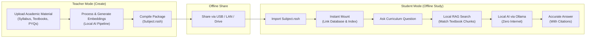

# Teacher & Student Workflow (Horizontal)

A simple horizontal workflow showing how Teachers create `.rssh` packages and how Students study offline.

---

## Horizontal End-to-End Flow

```mermaid
flowchart LR
    subgraph Teacher_Mode ["Teacher Mode (Create)"]
        T1["Upload Academic Material<br/>(Syllabus, Textbooks, PYQs)"] --> T2["Process & Generate Embeddings<br/>(Local AI Pipeline)"] --> T3["Compile Package<br/>(Subject.rssh)"]
    end

    subgraph Distribution ["Offline Share"]
        D1["Share via USB / LAN / Drive"]
    end

    subgraph Student_Mode ["Student Mode (Offline Study)"]
        S1["Import Subject.rssh"] --> S2["Instant Mount<br/>(Link Database & Index)"] --> S3["Ask Curriculum Question"] --> S4["Local RAG Search<br/>(Match Textbook Chunks)"] --> S5["Local AI via Ollama<br/>(Zero Internet)"] --> S6["Accurate Answer<br/>(With Citations)"]
    end

    T3 --> D1 --> S1
```
